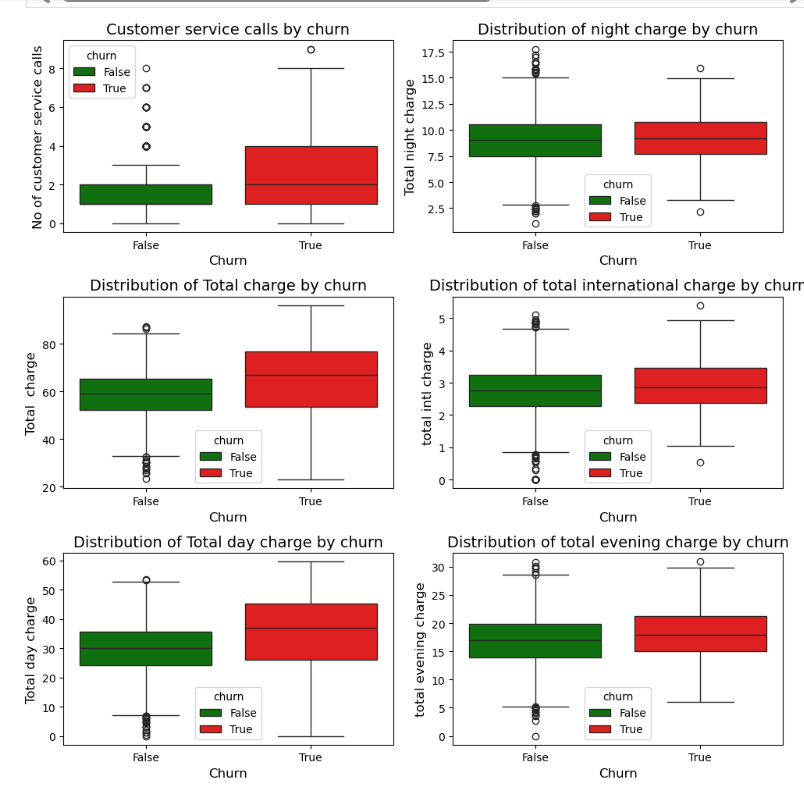
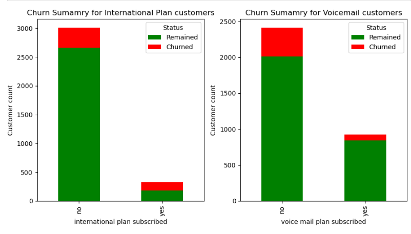
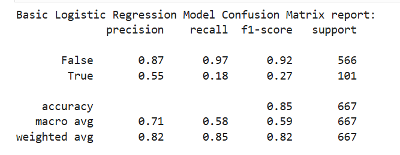
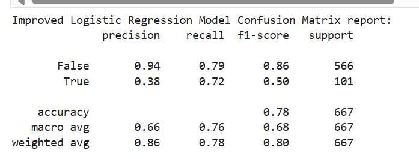
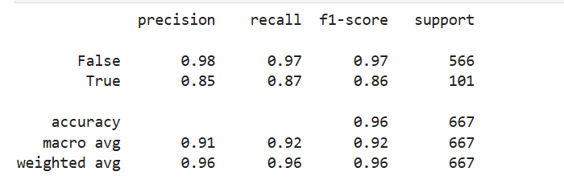
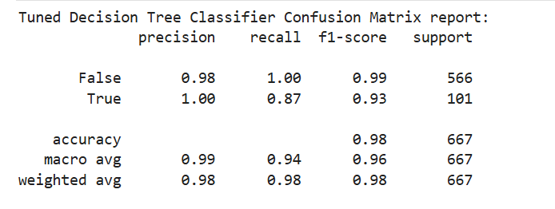

# **CHURN PREDICTION PROJECT**
## **Project Overview:**
In this project, I used data analytics and classification modelling techniques to generate insights on customer churn and predict customer churn for the company.

## 1.1 **Business Understanding**: 
Our company offers telecommunication service to customers spread across various location, the customers enjoy diverse billing tariffs and subscription packages.  
The company has been faced with significant drop in revenue despite implementing strategies to grow the customer base.  
Management is concerned about the customer churn and is seeking understanding of the customer behaviours to adopt proactive strategies to retain them at minimal cost.

## 1.2 **Business Objectives**:   
The aim of this review is to design a data driven model to help identify the factors that influence customers to exit the company.  
The model will also support the company management to identify customers who are likely to exit.  
The company management will then design initiatives targeting the possible exits to retain them such as offering promotions, reviewing quality of customer service  touch points etc.
a
 # 2.0 **Data Understanding**:
The project was undertaken using SyriaTel Customer Churn data  that can be accessed from the below link:  
https://www.kaggle.com/datasets/becksddf/churn-in-telecoms-dataset  

## 1.3 **Model Success Metrics**:  
The prediction model should be able to capture at least 85% of all the customers who churn(Recall of **85%**).  
The model should be  have a high ability to exclude false positives and false negatives achieving an F1 score of at least **85%**.  
The project should also identify features that influence customer churn.

## **Results:**
##  **Factors influencing churn:**
Customers who churned had received a higher customer service calls than those who remained.
Customers who exited experienced similar night charges to those who remained. Night charges may not have a higher influence on churn.
Churners were experienced relatively higher total charges than those who did not exit.
Customers who exited experienced similar international charges to those who remained. International charges may not have a higher influence on churn.
Churners experienced higher day time charges than non churners.
Customers who exited experienced similar evening charges to those who remained. Evening charges may not have a higher influence on churn.

##  **Churn per product:**
Most customers were not on international plan.
In both international and non international plan, more customers were retained compared to those that exited.
There were less customers on voice mail plan compared to those that were not subscribed to voice mail plan.
In both cases under voice mail plan , less customers exited.

##  **Models developed:**
The project uses 4 classifier models namely.
Basic logistic regression model
Tuned logistic regression model with scaling and class balancing
Basic decision tree classification model
Tuned decision tree classification with parameter tuning.
##  **Model performance:**
Basic logistic regression model:
The model was 85% accurate.
The model is correct 87% of the time in predicting non churners .
It has a lower capacity to correctly predict churners since it is only accurate 55% of the time.
Of all the customers who churned, the model only predicted 18%.
The base model has thus scored poorly on its ability to be relied upon by the company to correctly predict churners.
The model has a higher F1 score of 92% in predicting non churners.
It is not performing well when predicting churners for the company to use.

**Tuned logistic regression model**:

Overall accuracy had declined to 78% from 85% in the base model.  
The accuracy in predicting non churners has declined to 79% from 87% in the base model.   
The ability to correctly predict churners has improved to 72% from 18%.  
The f1 score has in predicting churners has improved to 50% from 27% in the base model.  
Overall the standardised model has performed better in predicting churners than the base model. 

**Basic Decision tree Model**:
Overall accuracy has improved to 96% compared to 78% in the improved regression model and 85% in the base regression model.
The accuracy in predicting non churners has increased to 98%.
The ability to correctly predict churners has improved 87% compared to 72% in improved Regression model and 18% in base regression model.
The f1 score has in predicting churners has improved to 87% compared to 50% in improved regression model and 27% in the base model.
Overall the base decision tree model has a higher value to the company than both of the logistic regression models in predicting customer churn.

**Tuned decision tree Model**:
Overall accuracy has improved to 98% the highest among all the four models.
The accuracy in predicting non churners has increased to 100%.
The ability to correctly predict churners has remained at 87% similar to the base decision tree model which was higher than both regression models.
F1 score in predicting churners has improved to 83%, the highest of the four models.

## **Recommendations and way forward**
We recommend that the company adopts the improved decision tree classifier model to predict the churn.  
The management should take not that there will be **7% risk** that true churners will not be detected by the model.  
The company undertakes a business impact analysis of the 7% risk to evaluate further investments needed to improve the model.  
With new discoveries on the customer profiles, continued enhancement of the model can be done to improve its utility.

